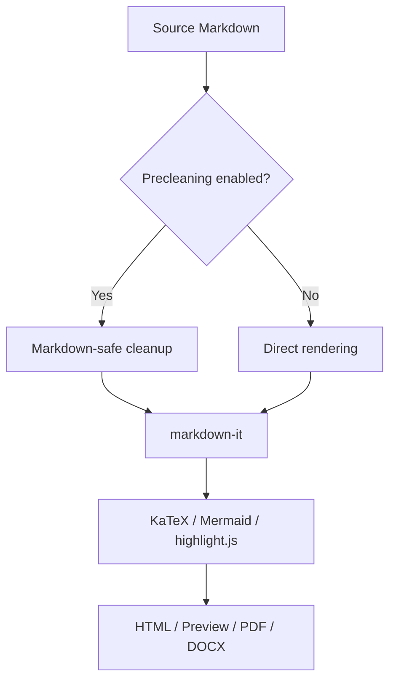
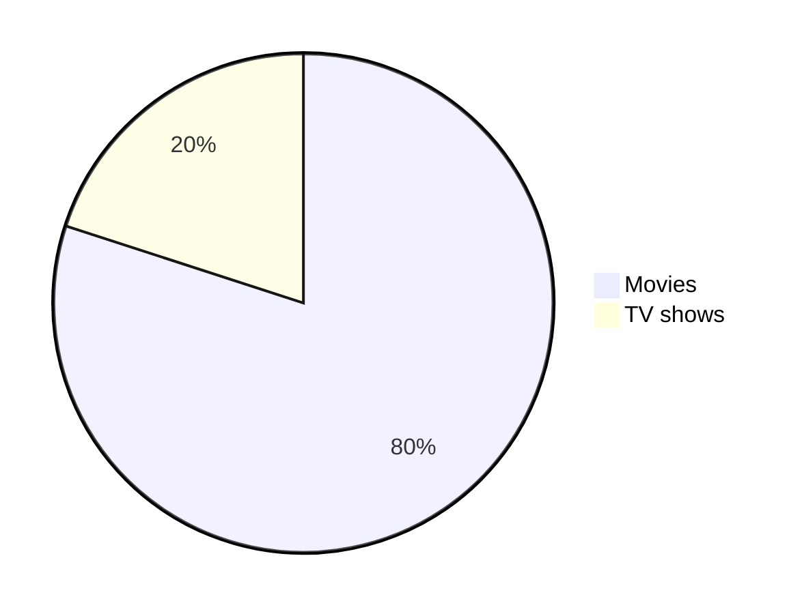

# Markdown → HTML — ordered comprehensive test

This file is intended to test the local Markdown converter: preview, PDF, HTML, TXT export ~~and DOCX export~~. The example combines basic Markdown, GFM extensions, raw HTML, formulas, diagrams, music notation, images, tables, code, and GitHub-specific elements. Blocks are grouped by functionality.

<a name="top"></a>

## Contents

- [Precleaning and special characters](#precleaning-and-special-characters)
- [Headings and horizontal rules](#headings-and-horizontal-rules)
- [Text styles](#text-styles)
- [Links, anchors, and autolinks](#links-anchors-and-autolinks)
- [Images, badges, and video previews](#images-badges-and-video-previews)
- [Lists](#lists)
- [Blockquotes and GitHub alerts](#blockquotes-and-github-alerts)
- [Tables](#tables)
- [Code and syntax highlighting](#code-and-syntax-highlighting)
- [Formulas](#formulas)
- [Mermaid diagrams](#mermaid-diagrams)
- [ABC notation](#abc-notation)
- [Raw HTML and embedded components](#raw-html-and-embedded-components)
- [GitHub-specific elements](#github-specific-elements)
- [Miscellaneous](#miscellaneous)
- [External reference links](#external-reference-links)

---

## Precleaning and special characters

Typography test: Russian guillemets «should be preserved», while “English curly quotes” should become regular "straight quotes" when quote cleanup is enabled.

NBSP and narrow NBSP: 10 000 and 10 000.

Escaped symbol: \#not-a-heading.

The `^` character in plain text: ^caret^.

The `^` character in a formula: $x^2 + y^2 = z^2$.

The `^` character in code: `^caret^`.

Text with several   spaces in a regular line — useful for checking the space-compaction option.

Hard line break using two trailing spaces:  
this line should start on a new line.

Line break using a backslash:\
this line should also start on a new line.

The HTML comment `<!-- Comment used to test HTML comment handling. -->` below should not appear in the preview.

<!--
Comment used to test HTML comment handling.
-->

---

## Headings and horizontal rules

### Markdown headings

```md
# Heading 1
## Heading 2
### Heading 3
#### Heading 4
##### Heading 5
###### Heading 6
```

# Heading 1
## Heading 2
### Heading 3
#### Heading 4
##### Heading 5
###### Heading 6

### Setext headings

```md
Alt-H1
======

Alt-H2
------
```

Alt-H1
======

Alt-H2
------

### HTML headings

```html
<h1>HTML Heading 1</h1>
<h2>HTML Heading 2</h2>
<h3 align="center">Centered HTML Heading 3</h3>
```

<h1>HTML Heading 1</h1>
<h2>HTML Heading 2</h2>
<h3 align="center">Centered HTML Heading 3</h3>

### Horizontal rules

```md
---
***
___
```

Hyphens:

---

Asterisks:

***

Underscores:

___

---

## Text styles

### Basic formatting

```md
Normal text.
*Italic with asterisks* and _italic with underscores_.
**Bold with asterisks** and __bold with underscores__.
***Bold italic*** and **bold with _nested italic_**.
~~Strikethrough~~.
```

Normal text.

*Italic with asterisks* and _italic with underscores_.

**Bold with asterisks** and __bold with underscores__.

***Bold italic*** and **bold with _nested italic_**.

~~Strikethrough~~.

### HTML text styles

```html
<strong>Strong HTML</strong>
<em>Emphasis HTML</em>
<ins>Underlined text</ins>
<samp>Monospaced sample</samp>
<sub>subscript</sub> and <sup>superscript</sup>
```

<strong>Strong HTML</strong>

<em>Emphasis HTML</em>

<ins>Underlined text</ins>

<samp>Monospaced sample</samp>

log<sub>2</sub>(x), 2<sup>53</sup> and small text: <sup><sub>The quick brown fox jumps over the lazy dog.</sub></sup>

### Buttons and keys

```html
<kbd>command + B</kbd>
<kbd>control + I</kbd>
<kbd>cmd + shift + p</kbd>
```

<kbd>command + B</kbd>, <kbd>control + I</kbd>, <kbd>cmd + shift + p</kbd>

[<kbd>Markdown-Cheatsheet</kbd>](https://github.com/lifeparticle/Markdown-Cheatsheet)

<kbd> <br> [Markdown-Cheatsheet](https://github.com/lifeparticle/Markdown-Cheatsheet) ↗️ <br> </kbd>

### Escaping Markdown characters

```md
\* Asterisk
\\ Backslash
\` Backtick
\{} Curly braces
\. Dot
\! Exclamation mark
\# Hash symbol
\- Hyphen symbol
\() Parentheses
\+ Plus symbol
\[] Square brackets
\_ Underscore
```

\* Asterisk  
\\ Backslash  
\` Backtick  
\{} Curly braces  
\. Dot  
\! Exclamation mark  
\# Hash symbol  
\- Hyphen symbol  
\() Parentheses  
\+ Plus symbol  
\[] Square brackets  
\_ Underscore

---

## Links, anchors, and autolinks

### Inline links, titles, and query strings

```md
[Inline link](https://www.google.com)
[Inline link with title](https://www.google.com "Google's Homepage")
[Link with a query string](https://example.com/docs?q=markdown&mode=local "Example link")
```

[Inline link](https://www.google.com)

[Inline link with title](https://www.google.com "Google's Homepage")

[Link with a query string](https://example.com/docs?q=markdown&mode=local "Example link")

### Reference links

```md
[Reference-style link][reference text]
[Reference-style link by number][1]
[Markdown-Cheat-Sheet]

[reference text]: https://www.mozilla.org
[1]: https://slashdot.org
[Markdown-Cheat-Sheet]: https://github.com/lifeparticle/Markdown-Cheatsheet
```

[Reference-style link][reference text]

[Reference-style link by number][1]

[Markdown-Cheat-Sheet]

[reference text]: https://www.mozilla.org
[1]: https://slashdot.org
[Markdown-Cheat-Sheet]: https://github.com/lifeparticle/Markdown-Cheatsheet

### Relative, enclosed, auto, and section links

```md
[Relative repository file](../blob/master/LICENSE)
[Relative local file](rl.md)
<https://github.com/>
Visit https://www.example.com
Email at example@example.com
[Jump to Mermaid](#mermaid-diagrams)
```

[Relative repository file](../blob/master/LICENSE)

[Relative local file](rl.md)

<https://github.com/>

Visit https://www.example.com

Email at example@example.com

[Jump to Mermaid](#mermaid-diagrams)

### Local anchor

<a id="sample-anchor" href="#sample-anchor">#sample-anchor</a>

Local anchor for testing links inside the document.

[Back to top](#top) | [:arrow_up:](#top)

---

## Images, badges, and video previews

### Local, remote, and reference images

```md


![Reference image][image-ref]

[image-ref]: https://octodex.github.com/images/dojocat.jpg "The Dojocat"
```


![Reference image][image-ref]

[image-ref]: https://octodex.github.com/images/dojocat.jpg "The Dojocat"

### HTML image and linked image

```html

<a href="https://binarytree.dev/" target="_blank"></a>
```


<a href="https://binarytree.dev/" target="_blank"></a>

### Picture tag and dark/light mode

```html
<picture>
  <source media="(prefers-color-scheme: dark)" srcset="md.svg">
  <source media="(prefers-color-scheme: light)" srcset="md.svg">
  
</picture>
```

<picture>
  <source media="(prefers-color-scheme: dark)" srcset="md.svg">
  <source media="(prefers-color-scheme: light)" srcset="md.svg">
  
</picture>

### Image groups

Horizontal images:

<p>
  
  
  
</p>

Vertical images:

<p>
  <br><br>
  <br><br>
  
</p>

### Badges and YouTube preview

```md

[](https://www.youtube.com/watch?v=ciawICBvQoE)
```


[](https://www.youtube.com/watch?v=ciawICBvQoE)

HTML variant of a YouTube preview:

<a href="https://www.youtube.com/watch?feature=player_embedded&v=YOUTUBE_VIDEO_ID_HERE" target="_blank">

</a>

### Video URL

https://github.com/user-attachments/assets/90c624e0-f46b-47a7-8509-97585dc3688a

---

## Lists

### Ordered and unordered

```md
1. First ordered list item
2. Another item
   - Unordered sub-list
   1. Ordered sub-list
4. And another item

* Unordered list can use asterisks
- Or minuses
+ Or pluses
```

1. First ordered list item
2. Another item
   - Unordered sub-list
   1. Ordered sub-list
4. And another item

* Unordered list can use asterisks
- Or minuses
+ Or pluses

### Deep nesting

```md
1. Make my changes
   1. Fix bug
   2. Improve formatting
      - Make the headings bigger
2. Push my commits to GitHub
3. Open a pull request
   * Describe my changes
   * Mention all the members of my team
     * Ask for feedback
```

1. Make my changes
   1. Fix bug
   2. Improve formatting
      - Make the headings bigger
2. Push my commits to GitHub
3. Open a pull request
   * Describe my changes
   * Mention all the members of my team
     * Ask for feedback

### HTML-list

```html
<ul>
  <li>First item</li>
  <li>Second item</li>
  <li>Third item</li>
</ul>
```

<ul>
  <li>First item</li>
  <li>Second item</li>
  <li>Third item</li>
</ul>

### Task lists

```md
- [x] Finish my changes
- [ ] Push my commits to GitHub
- [ ] Open a pull request
- [x] @mentions, #refs, [links](), **formatting**, and <del>tags</del> supported
- [x] list syntax required (any unordered or ordered list supported)
- [x] this is a complete item
- [ ] this is an incomplete item
```

- [x] Finish my changes
- [ ] Push my commits to GitHub
- [ ] Open a pull request
- [x] @mentions, #refs, [links](), **formatting**, and <del>tags</del> supported
- [x] list syntax required (any unordered or ordered list supported)
- [x] this is a complete item
- [ ] this is an incomplete item

### Paragraphs and line breaks inside lists

1. List item with a paragraph.

   This paragraph belongs to the previous list item.

2. List item with a hard break.  
   This line remains inside the same list item.

---

## Blockquotes and GitHub alerts

### Blockquotes

```md
> Blockquotes are very handy in email to emulate reply text.
> This line is part of the same quote.

Quote break.

> This is a very long line that will still be quoted properly when it wraps. Oh, you can *put* **Markdown** into a blockquote.

> Blockquotes can also be nested...
>> ...by using additional greater-than signs right next to each other...
> > > ...or with spaces between arrows.
```

> Blockquotes are very handy in email to emulate reply text.
> This line is part of the same quote.

Quote break.

> This is a very long line that will still be quoted properly when it wraps. Oh, you can *put* **Markdown** into a blockquote.

> Blockquotes can also be nested...
>> ...by using additional greater-than signs right next to each other...
> > > ...or with spaces between arrows.

### Alerts

```md
> [!NOTE]
> Essential details that users should not overlook.

> [!TIP]
> Additional advice to aid users in achieving better outcomes.

> [!IMPORTANT]
> Vital information required for users to attain success.

> [!WARNING]
> Urgent content that requires immediate user focus due to possible risks.

> [!CAUTION]
> Possible negative outcomes resulting from an action.
```

> [!NOTE]
> Essential details that users should not overlook.

> [!TIP]
> Additional advice to aid users in achieving better outcomes.

> [!IMPORTANT]
> Vital information required for users to attain success.

> [!WARNING]
> Urgent content that requires immediate user focus due to possible risks.

> [!CAUTION]
> Possible negative outcomes resulting from an action.

---

## Tables

### Markdown tables and alignment

```md
| Default | Left align | Center align | Right align |
| - | :- | :-: | -: |
| 9999999999 | 9999999999 | 9999999999 | 9999999999 |
| 999999999 | 999999999 | 999999999 | 999999999 |
```

| Default | Left align | Center align | Right align |
| - | :- | :-: | -: |
| 9999999999 | 9999999999 | 9999999999 | 9999999999 |
| 999999999 | 999999999 | 999999999 | 999999999 |

### Inline Markdown inside cells

```md
| Command | Description |
| --- | --- |
| `git status` | List all *new or modified* files |
| `git diff` | Show file differences that **haven't been** staged |
```

| Command | Description |
| --- | --- |
| `git status` | List all *new or modified* files |
| `git diff` | Show file differences that **haven't been** staged |

### Formulas, HTML, and special characters in a table

| Field | Value | Comment |
|:--|--:|:--|
| A | 10 | `code` inside a cell |
| B | 20 | formula $a^2+b^2=c^2$ |
| C | 30 | HTML <mark>inline</mark> |
| Backtick | ` | a single backtick |
| Pipe | \| | escaped vertical bar |

### Multiline cell

```md
| A | B | C |
|---|---|---|
| 1 | 2 | 3 <br> 4 <br> 5 |
```

| A | B | C |
|---|---|---|
| 1 | 2 | 3 <br> 4 <br> 5 |

### HTML table

```html
<table>
<tr>
<th>Heading 1</th>
<th>Heading 2</th>
</tr>
<tr>
<td width="50%">The quick brown fox jumps over the lazy dog.</td>
<td width="50%">The quick brown fox jumps over the lazy dog.</td>
</tr>
</table>
```

<table>
<tr>
<th>Heading 1</th>
<th>Heading 2</th>
</tr>
<tr>
<td width="50%">The quick brown fox jumps over the lazy dog.</td>
<td width="50%">The quick brown fox jumps over the lazy dog.</td>
</tr>
</table>

### Markdown table inside an HTML table

<table>
<tr>
<th>Nested table A</th>
<th>Nested table B</th>
</tr>
<tr>
<td>

| A | B | C |
|--|--|--|
| 1 | 2 | 3 |

</td>
<td>

| X | Y | Z |
|--|--|--|
| 7 | 8 | 9 |

</td>
</tr>
</table>

### Code block inside HTML table

<table>
<tr>
<th>Before Hoisting</th>
<th>After Hoisting</th>
</tr>
<tr>
<td>
<pre lang="js">
console.log(fullName); // undefined
fullName = "Dariana Trahan";
console.log(fullName); // Dariana Trahan
var fullName;
</pre>
</td>
<td>
<pre lang="js">
var fullName;
console.log(fullName); // undefined
fullName = "Dariana Trahan";
console.log(fullName); // Dariana Trahan
</pre>
</td>
</tr>
</table>

---

## Code and syntax highlighting

Code blocks are arranged by function: Markdown/plain text first, then shell/diff, frontend, backend, and other languages.

### Inline code and plain code

```md
Inline `code` has `back-ticks around` it.
```

Inline `code` has `back-ticks around` it.

```text
Plain text code block
with multiple lines
and symbols: ^ $ * _ # < > &
```

### Markdown source inside Markdown

````md
```md
# Nested Markdown example

- item
- item
```
````

### Shell / terminal commands

```bash
cd /var/www/example
npm install
npm run build
```

```powershell
Set-Location C:\Docs\Project
npm install
npm run build
```

### Diff

```diff
## git diff a/test.txt b/test.txt
diff --git a/a/test.txt b/b/test.txt
index 309ee57..c995021 100644
--- a/a/test.txt
+++ b/b/test.txt
@@ -1,8 +1,6 @@
-The quick brown fox jumps over the lazy dog
+The quick brown fox jumps over the lazy cat

 a
-b
 c
 d
-e
 f
```

```diff
- Text in Red
+ Text in Green
! Text in Orange
# Text in Gray
@@ Text in Purple and bold @@
```

### Frontend: HTML

```html
<dl>
  <dt>Definition list</dt>
  <dd>Is something people use sometimes.</dd>

  <dt>Markdown in HTML</dt>
  <dd>Does *not* work **very** well. Use HTML <em>tags</em>.</dd>
</dl>
```

### Frontend: CSS

```css
@font-face {
  font-family: Chunkfive;
  src: url('Chunkfive.otf');
}

body, .usertext {
  color: #F0F0F0;
  background: #600;
  font-family: Chunkfive, sans;
}

@import url(print.css);
@media print {
  a[href^=http]::after {
    content: attr(href);
  }
}
```

### Frontend: JavaScript

```javascript
function $initHighlight(block, cls) {
  try {
    if (cls.search(/\bno\-highlight\b/) !== -1) {
      return process(block, true, 0x0F) + ` class="${cls}"`;
    }
  } catch (e) {
    /* handle exception */
  }

  for (let i = 0; i < classes.length; i++) {
    if (checkCondition(classes[i]) === undefined) {
      console.log('undefined');
    }
  }
}

export { $initHighlight };
```

### Frontend: TypeScript

```ts
interface UserCard {
  id: number;
  name: string;
  flags?: string[];
}

const data: UserCard = {
  id: 7,
  name: "Markdown ^ HTML",
  flags: ["safe-clean", "local-only"]
};

console.log(data);
```

### Backend / general: Java

```java
public static String monthNames[] = {
  "January", "February", "March", "April", "May", "June",
  "July", "August", "September", "October", "November", "December"
};
```

### Backend / general: C#

```csharp
using System.IO.Compression;

#pragma warning disable 414, 3021

namespace MyApplication
{
    [Obsolete("...")]
    class Program : IInterface
    {
        public static List<int> JustDoIt(int count)
        {
            Console.WriteLine($"Hello {Name}!");
            return new List<int>(new int[] { 1, 2, 3 });
        }
    }
}
```

### Backend / general: PHP

```php
require_once 'Zend/Uri/Http.php';

namespace Location\Web;

interface Factory
{
    public static function _factory();
}

abstract class URI extends BaseURI implements Factory
{
    abstract public function test();

    public static $st1 = 1;
    public const ME = "Yo";
    private $var;

    /**
     * Returns a URI.
     *
     * @return array
     */
    public static function _factory($stats = [], $uri = 'http')
    {
        $parts = explode(':', $uri, 2);
        $schemeSpecific = $parts[1] ?? '';

        if (!ctype_alnum($parts[0])) {
            throw new \InvalidArgumentException('Illegal scheme');
        }

        return [
            'uri' => $parts,
            'schemeSpecific' => $schemeSpecific,
            'value' => null,
        ];
    }
}

echo URI::ME . URI::$st1;
```

### Code inside strikethrough

<strike>

```js
console.log('Error');
```

</strike>

---

## Formulas

### Inline math

Inline: $E = mc^2$, $\alpha + \beta \to \gamma$, and $\text{price} = 5{,}0$.

This is an inline math expression $x = {-b \pm \sqrt{b^2-4ac} \over 2a}$.

### Block math

$$
\int_0^1 x^2 \, dx = \frac{1}{3}
$$

$$
x = {-b \pm \sqrt{b^2-4ac} \over 2a}
$$

\[
\sum_{k=1}^{n} k = \frac{n(n+1)}{2}
\]

### Align environment

\begin{align}
 a^2 + b^2 &= c^2 \\
 e^{i\pi} + 1 &= 0 \\
 \nabla \cdot \vec{E} &= \frac{\rho}{\varepsilon_0}
\end{align}

### Colored text through math syntax

| Color Name | Code | Example |
|---|---|---|
| Apricot | `\color{Apricot}{The\ quick\ brown\ fox}` | $\color{Apricot}{The\ quick\ brown\ fox}$ |
| Aquamarine | `\color{Aquamarine}{The\ quick\ brown\ fox}` | $\color{Aquamarine}{The\ quick\ brown\ fox}$ |
| Bittersweet | `\color{Bittersweet}{The\ quick\ brown\ fox}` | $\color{Bittersweet}{The\ quick\ brown\ fox}$ |
| Black | `\color{Black}{The\ quick\ brown\ fox}` | $\color{Black}{The\ quick\ brown\ fox}$ |

---

## Mermaid diagrams

### Flowchart



### Pie chart



---

## ABC notation

```abc
X:1
T:Scale
M:4/4
L:1/4
K:C
C D E F | G A B c |
```

---

## Raw HTML and embedded components

### Details / summary

<details open>
  <summary>HTML block</summary>
  <p data-note="a — b">This block must not be broken by precleaning.</p>
</details>

### Definition list

<dl>
  <dt>Definition list</dt>
  <dd>Is something people use sometimes.</dd>

  <dt>Markdown in HTML</dt>
  <dd>Does *not* work **very** well. Use HTML <em>tags</em>.</dd>
</dl>

### Boxed text through an HTML table

<table><tr><td>The quick brown fox jumps over the lazy dog.</td></tr></table>

### Alignments

<p align="left">

</p>

<p align="center">

</p>

<p align="right">

</p>

---

## GitHub-specific elements

### Mention people and teams

In issues:

```md
@lifeparticle
```

[Example shown in issue](https://github.com/lifeparticle/Markdown-Cheatsheet/issues/1)

In markdown file:

```md
https://github.com/lifeparticle
```

https://github.com/lifeparticle

### Reference issues and pull requests

In issues:

```md
#1
#10
```

[Example shown in issue](https://github.com/lifeparticle/Markdown-Cheatsheet/issues/1)

In markdown file:

```md
https://github.com/lifeparticle/Markdown-Cheatsheet/issues/1
https://github.com/lifeparticle/Markdown-Cheatsheet/pull/10
```

https://github.com/lifeparticle/Markdown-Cheatsheet/issues/1

https://github.com/lifeparticle/Markdown-Cheatsheet/pull/10

### Color models

In issues:

```md
`#ffffff`
`#000000`
`rgb(255, 0, 0)`
`hsl(120, 100%, 50%)`
```

`#ffffff`  
`#000000`  
`rgb(255, 0, 0)`  
`hsl(120, 100%, 50%)`

[Example shown in issue](https://github.com/lifeparticle/Markdown-Cheatsheet/issues/1)


### Code in titles

In issue and pull request titles:

```md
`TEST` ISSUE
```

`TEST` ISSUE

### Reference labels

Labels referenced by URLs in Markdown are now automatically rendered on GitHub.

https://github.com/lifeparticle/Markdown-Cheatsheet/labels/documentation

```md
https://github.com/lifeparticle/Markdown-Cheatsheet/labels/documentation
```

### GitHub README header and status badge

<h1 align="center">
  :black_circle: The Ultimate Markdown Cheat Sheet :black_circle:
</h1>

<div align="center">
  <a href="https://github.com/lifeparticle/Markdown-Cheatsheet/actions/workflows/readme-checker.yml">
    
  </a>
</div>

---

## Miscellaneous

### Emojis

```md
:octocat:
:shipit:
:100:
:heavy_plus_sign:
:partly_sunny:
:woman_technologist:
```

:octocat: :shipit: :100: :heavy_plus_sign: :partly_sunny: :woman_technologist:

[Complete list of GitHub markdown emoji markup](https://gist.github.com/rxaviers/7360908)

### Footnotes

```md
Footnote 1 link[^fn-first].
Footnote 2 link[^fn-second].
Duplicated footnote reference[^fn-second].

[^fn-first]: Footnote **can have markup** and multiple paragraphs.

    This indented paragraph belongs to the first footnote.

[^fn-second]: Footnote text.
```

Footnote 1 link[^fn-first].

Footnote 2 link[^fn-second].

Duplicated footnote reference[^fn-second].

[^fn-first]: Footnote **can have markup** and multiple paragraphs.

    This indented paragraph belongs to the first footnote.

[^fn-second]: Footnote text.

### Collapsible item with Markdown inside

```md
<details>
  <summary>Markdown</summary>

- <kbd>[Markdown Editor](https://binarytree.dev/me)</kbd>
- <kbd>[Table Of Content](https://binarytree.dev/toc)</kbd>
- <kbd>[Markdown Table Generator](https://binarytree.dev/md_table_generator)</kbd>

</details>
```

<details>
  <summary>Markdown</summary>

- <kbd>[Markdown Editor](https://binarytree.dev/me)</kbd>
- <kbd>[Table Of Content](https://binarytree.dev/toc)</kbd>
- <kbd>[Markdown Table Generator](https://binarytree.dev/md_table_generator)</kbd>

</details>

### Back to top

First place this code at the start of the Markdown file:

```md
<a name="top"></a>
```

Then use:

```md
[Back to top](#top)
[:arrow_up:](#top)
```

[Back to top](#top)

[:arrow_up:](#top)

---

## External reference links

- Markdown: [John Gruber Markdown](https://daringfireball.net/projects/markdown/)
- CommonMark: [CommonMark specification](https://commonmark.org/)
- GitHub Flavored Markdown: [GFM specification](https://github.github.com/gfm/)
- GitHub Markdown docs: [Basic writing and formatting syntax](https://docs.github.com/en/get-started/writing-on-github/getting-started-with-writing-and-formatting-on-github/basic-writing-and-formatting-syntax)
- Bitbucket Supported Markdown: [Bitbucket Markdown syntax guide](https://confluence.atlassian.com/bitbucketserver/markdown-syntax-guide-776639995.html)
- Azure DevOps Project wiki: [Azure DevOps Markdown guidance](https://learn.microsoft.com/en-us/azure/devops/project/wiki/markdown-guidance)
- MDX: [MDX documentation](https://mdxjs.com/)
- Markdown tools: [Markdownlint](https://github.com/DavidAnson/markdownlint), [MarkItDown](https://github.com/microsoft/markitdown), [Awesome Markdown](https://github.com/mundimark/awesome-markdown)
